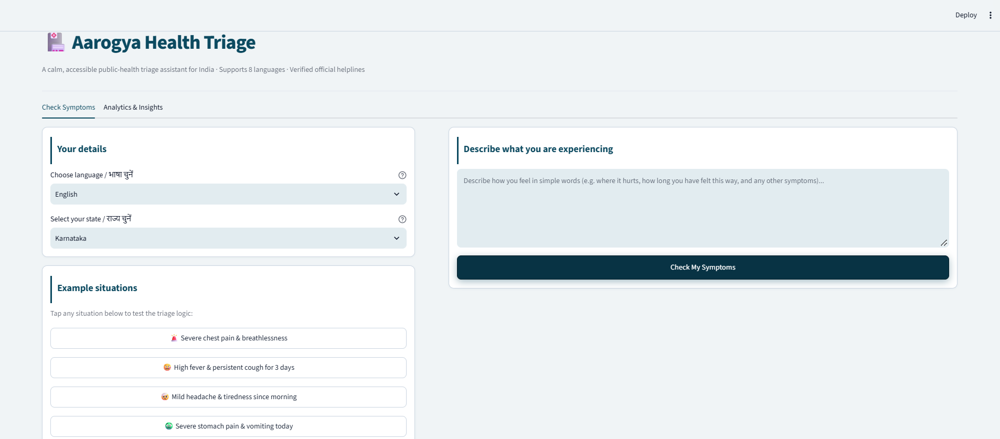
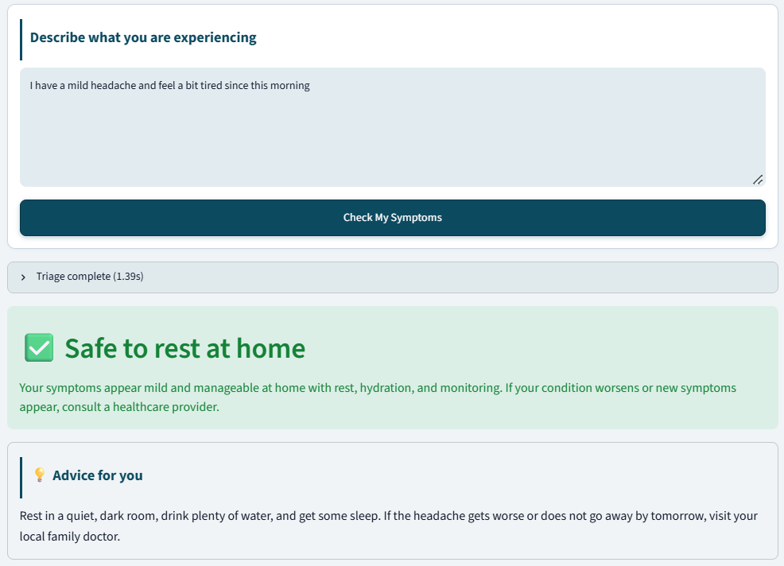
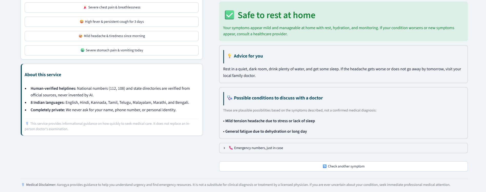

# 🏥 Aarogya — Multilingual Public Health Symptom Triage

[](https://www.python.org/)
[](https://streamlit.io/)
[](https://github.com/googleapis/python-genai)
[](https://deepmind.google/technologies/gemini/)
[-brightgreen.svg)]()
[-brightgreen.svg)]()

An AI-driven public health triage system designed for multilingual healthcare access in India. **Aarogya** evaluates user-reported symptoms in **8 Indian languages**, assesses clinical urgency into standard triage tiers (**RED** / **YELLOW** / **GREEN**), provides actionable home-care guidance and doctor discussion points, and immediately connects emergency patients to **human-verified national helplines** (plus state-specific entries where available).

Built as an applied portfolio piece demonstrating **production-grade Generative AI engineering, asymmetric risk evaluation, defensive API design, and telemetry logging** for Data Scientist, ML Engineer, and GenAI Engineer roles.

## 🎥 Demo (1 min)

[](https://www.youtube.com/watch?v=oBPMl9tbALY)

[▶ Watch the demo on YouTube](https://www.youtube.com/watch?v=oBPMl9tbALY)

*A walkthrough of a RED emergency case, a YELLOW case and a non-English case.*

---

## 📌 Project Overview

Accessing emergency medical triage in India presents two distinct bottlenecks:
1. **The Linguistic Divide**: Many people are more comfortable in a regional language than in English, but digital health tools mostly assume English or rely on error-prone translation cascades.
2. **The LLM Reliability Dilemma**: Foundation models can invent plausible-sounding phone numbers, hallucinate medical facts, or drift in formatting, turning a health assistant into a liability.

Aarogya addresses both challenges by treating LLM outputs not as infallible answers, but as probabilistic components constrained by strict schemas, defensive Unicode validation, and human-verified deterministic emergency directories.

### Supported Languages
| Language | Script | Primary regions |
| :--- | :--- | :--- |
| **English** | Latin | Global / Indian English |
| **हिंदी (Hindi)** | Devanagari | Standard Hindi |
| **ಕನ್ನಡ (Kannada)** | Kannada | Karnataka regional |
| **தமிழ் (Tamil)** | Tamil | Tamil Nadu & Puducherry |
| **తెలుగు (Telugu)** | Telugu | Andhra Pradesh & Telangana |
| **മലയാളം (Malayalam)** | Malayalam | Kerala & Lakshadweep |
| **मराठी (Marathi)** | Devanagari | Maharashtra & Goa |
| **বাংলা (Bengali)** | Bengali | West Bengal & Tripura |

---

## 🏗️ System Architecture

Aarogya replaces the high-latency 3-step translation cascade (`Translate-In -> Assess -> Translate-Out`) with **direct in-language reasoning in a single round trip**, cutting free-tier latency from ~12-18s to ~1.5s for non-English requests (measured on the free tier with the old three-call chain).

```
                           User Input
               (Any of 8 Indian Languages + State)
                                │
                                ▼
    ┌────────────────────────────────────────────────────────┐
    │              Gemini 3.5 Flash-Lite                     │
    │  • SDK: google-genai (v2.0+)                           │
    │  • Mode: types.ThinkingConfig(thinking_level="minimal")│
    │  • Output: Constrained JSON Schema                     │
    │  • Task: In-language triage + English symptom summary  │
    └──────────────────────────┬─────────────────────────────┘
                               │
                               ▼
    ┌────────────────────────────────────────────────────────┐
    │             Defensive Validation Layer                 │
    │  1. Pydantic Runtime Validation (models.SymptomAssessment)
    │  2. Unicode Codepoint Boundary Check (_validate_script)│
    │     (Rejects foreign script leaks, e.g. Armenian)      │
    │  3. Automatic Single-Retry on Schema/Script Anomaly    │
    └──────────────────────────┬─────────────────────────────┘
                               │
                               ▼
                 Triage Severity Routing
                ┌──────────────┼──────────────┐
                ▼              ▼              ▼
           🚨 RED         ⚠️ YELLOW       ✅ GREEN
       (Life Threat)   (Seek Care 24h)   (Manage at Home)
                │              │              │
                ├──────────────┴──────────────┤
                ▼                             ▼
   Verified Emergency Directory     Telemetry & Logging
   • NEVER LLM-generated           • SQLite (consultations.db)
   • Tel URI links (112, 108)      • No names or contact details collected
   • Bilingual header/labels       • Real-time Streamlit
   • State-specific caveat logic     Analytics Dashboard
```


*Fast, direct in-language triage completing in 1.39s, classifying mild symptoms into the GREEN tier (Safe to rest at home) with supportive clinical advice.*

---

## 🛡️ "Why This Is Built This Way": Safety-Critical Engineering Decisions

In clinical triage, engineering choices cannot be treated as aesthetic preferences. Every architectural decision in Aarogya reflects defensive engineering principles:

### 1. Zero LLM Generation for Emergency Phone Numbers
* **The Failure Mode**: LLMs confidently hallucinate contact numbers, area codes, and outdated emergency lines. In a cardiac arrest or stroke situation, dialing an invented number can be fatal.
* **The Engineering Fix**: Emergency numbers are completely isolated from model generation. National emergency numbers in [emergency_data.py](emergency_data.py) (112, 108, 101, 1091, 1098, KIRAN) are static and verified against official Government of India sources ([india.gov.in](https://www.india.gov.in)), while state-specific entries currently exist only for Karnataka and Delhi, all rendered directly via native `tel:` HTML links.

### 2. Dual-Layer Schema Enforcement (Pydantic + Gemini JSON Schema)
* **The Failure Mode**: Parsing free-text completions with substring searches (e.g. `if "SEVERITY: RED" in response`) breaks silently when prompts or model weights shift. A missed condition can downgrade a critical emergency to mild advice.
* **The Engineering Fix**: Gemini's low-level API is supplied with `SYMPTOM_ASSESSMENT_JSON_SCHEMA` to force JSON output at generation time. The payload is then parsed through a strict Pydantic model ([models.py](models.py): `SymptomAssessment`). Any malformed output fails loudly and immediately triggers a self-correcting retry.

### 3. Asymmetric Loss Optimization: Prioritizing RED-Case Recall
* **The Loss Asymmetry**:
  * **False Positive (Type I Error)**: Classifying a mild headache (GREEN) as an emergency (RED). The user experiences temporary worry and visits an urgent clinic unnecessarily.
  * **False Negative (Type II Error)**: Classifying an acute myocardial infarction (RED) as mild indigestion (GREEN). The patient stays home and dies.
* **The Metric Choice**: While standard ML projects optimize for raw accuracy, Aarogya's evaluation harness tracks **RED-case recall** as the primary safety gate. Aggregate accuracy cannot be allowed to mask false negatives.

### 4. Bilingual Emergency Banners & State Fallback Caveat
* **Emergency Resilience**: If a patient in shock shows their phone screen to an English-speaking paramedic, bystander, or doctor, a screen written purely in regional script can impede care. All high-urgency banners, first-aid directives, and emergency phone labels render bilingually (`Local / English`).
* **Honest State Coverage**: Rather than guessing state-level helplines for states outside verified datasets, the UI explicitly displays an honest, calm disclaimer:
  > *"State-specific helplines aren't verified for [State] yet — the national numbers above work everywhere in India."*


*Transparent, clinically-grounded interface: plausible conditions for physician discussion, quietly available verified emergency numbers for non-emergency results, and service transparency.*

---

## 🔍 The Script-Confusion Bug: An Eval-Driven Discovery

One of the most compelling engineering narratives in this project was uncovered directly by the evaluation harness:

### 1. The Anomaly
During initial testing with Kannada symptom prompts, the model returned a correct `RED` severity classification, but the clinical advice and condition descriptions rendered in **Armenian script** rather than Kannada, while static headers correctly showed Kannada:

$$\text{Kannada Input} \xrightarrow{\text{LLM Generation}} \text{Armenian Unicode Block (U+0530 - U+058F)}$$

### 2. Root Cause Analysis
Suspected cause: low-resource Indic tokens being confused with another script under a minimal reasoning budget. The exact cause was not isolated; the fix targets the symptom with validation, not the root cause.

### 3. The Defensive Fix
Rather than relying on vague prompt tuning, we deployed a three-part defensive architecture:
1. **Prompt Script Anchoring**: Prompts dynamically inject explicit script target hints (e.g. `ಕನ್ನಡ (Kannada script)`) and an explicit negative constraint forbidding foreign scripts.
2. **Defensive Unicode Programmatic Boundary Check**: In [llm_client.py](llm_client.py), `_validate_language_script()` inspects Unicode codepoints across output fields:
   - Validates that text falls within the designated language block (e.g., Kannada: `0x0C80–0x0CFF`).
   - Hard-rejects known foreign Unicode blocks (Armenian `0x0530–0x058F`, Cyrillic `0x0400–0x04FF`, Greek `0x0370–0x03FF`).
   - Triggers an automated self-correcting retry if script corruption is detected.
3. **Eval Harness Expansion**: Expanded the test suite from 15 cases to **43 clinical test cases** covering all 8 supported languages, adding automated script integrity assertions.

---

## 📊 Evaluation Benchmark & Live Results

The evaluation harness ([eval/run_eval.py](eval/run_eval.py)) runs 43 curated clinical scenarios with known ground-truth severity, respecting API rate limits and measuring:
* **Severity Accuracy**: Exact match against expected triage level.
* **Combined RED-Case Recall**: Safety performance across all emergency cases.
* **English vs Non-English RED Recall**: Disaggregated to prevent regional regressions from hiding behind English performance.
* **Script Integrity**: Programmatic verification of Unicode rendering.
* **End-to-End Latency**: Execution time per call.

### Latest Live Evaluation Run Results

```
==============================================================================
PER-LANGUAGE EVALUATION RESULTS
==============================================================================
Language     | Cases | Severity Acc | RED Recall  | Script Integrity | Avg Lat
------------------------------------------------------------------------------
English      |    15 | 14/15 (93%)  | 6/6 (100%)  | 15/15 (100%)     | 1.46s  
Hindi        |     4 |  4/4 (100%)  | 2/2 (100%)  |  4/4 (100%)      | 1.23s  
Tamil        |     4 |  4/4 (100%)  | 2/2 (100%)  |  4/4 (100%)      | 1.59s  
Kannada      |     4 |  4/4 (100%)  | 2/2 (100%)  |  4/4 (100%)      | 1.68s  
Telugu       |     4 |  4/4 (100%)  | 2/2 (100%)  |  4/4 (100%)      | 1.58s  
Malayalam    |     4 |  4/4 (100%)  | 2/2 (100%)  |  4/4 (100%)      | 1.64s  
Marathi      |     4 |  4/4 (100%)  | 2/2 (100%)  |  4/4 (100%)      | 1.61s  
Bengali      |     4 |  4/4 (100%)  | 2/2 (100%)  |  4/4 (100%)      | 1.35s  
==============================================================================
Overall Severity Accuracy: 42/43 = 97.7%
Overall Script Integrity:  43/43 = 100.0%
Combined RED-Case Recall:  20/20 = 100.0%
------------------------------------------------------------------------------
👉 English RED-Case Recall:     6/6 = 100.0%
👉 Non-English RED-Case Recall: 14/14 = 100.0%
------------------------------------------------------------------------------
✅ Zero script corruption issues detected across all evaluated cases!
✅ Zero RED false negatives! All emergency cases correctly identified.
```

### Confusion Matrix

| Expected \ Actual | RED | YELLOW | GREEN |
| :--- | :---: | :---: | :---: |
| **RED (Emergency)** | **20** | 0 | 0 |
| **YELLOW (Doctor 24h)** | 0 | **11** | 1 |
| **GREEN (Home Care)** | 0 | 0 | **11** |

*(Note: The sole mismatch was a borderline vague case — `"not feeling well"` — classified as GREEN rather than YELLOW. Critically, zero RED cases were downgraded).*

---

## 💻 Tech Stack

* **Language**: Python 3.10+
* **LLM Engine**: Google Gemini 3.5 Flash-Lite (`gemini-3.5-flash-lite`) via `google-genai` SDK
* **Thinking Mode**: `types.ThinkingConfig(thinking_level="minimal")` for ultra-low latency
* **Frontend**: Streamlit (Native design system in Deep Trust Teal `#0C4A60`, zero non-standard CSS frameworks)
* **Data Validation**: Pydantic v2 & OpenAPI-compatible JSON Schemas
* **Persistence & Telemetry**: SQLite3 (`db.py`) & Pandas
* **Evaluation & Testing**: Custom Python evaluation harness (eval/run_eval.py)

---

## 🚀 Quickstart & Setup Guide

### 1. Clone the Repository
```bash
git clone https://github.com/Soundarya-Rao/Aarogya-symptom-checker.git
cd Aarogya-symptom-checker
```

### 2. Create and Activate Virtual Environment
```bash
# On Linux / macOS
python -m venv venv
source venv/bin/activate

# On Windows (PowerShell)
python -m venv venv
.\venv\Scripts\Activate.ps1

# On Windows (Command Prompt)
.\venv\Scripts\activate.bat
```

### 3. Install Dependencies
```bash
pip install -r requirements.txt
```

### 4. Configure API Key
Get an API key from Google AI Studio: [https://aistudio.google.com/](https://aistudio.google.com/).

Create a file named `.env` in the project root containing one line, with your real key in place of the placeholder:

```
GEMINI_API_KEY=your_gemini_api_key_here
```

Save it as UTF-8 in a text editor. On Windows PowerShell, don't use `echo ... > .env`, because it saves in the wrong encoding and the app fails on startup. Use this instead:

```powershell
Set-Content -Path .env -Value "GEMINI_API_KEY=your_gemini_api_key_here" -Encoding ascii
```

> [!CAUTION]
> **Security Notice**: Never commit `.env` or expose your API key. The repository's `.gitignore` explicitly prevents `.env` and local database files from being tracked.

### 5. Run the Streamlit Application
```bash
streamlit run app.py
```
Open [http://localhost:8501](http://localhost:8501) in your browser.

### 6. Run the Full Evaluation Benchmark
```bash
python eval/run_eval.py
```

---

## 📈 Real-Time Analytics Dashboard

Aarogya includes an integrated **Analytics & Insights** tab backed by SQLite (`consultations.db`), tracking:
* **Total Consultation Volume**: Real-time throughput metrics.
* **Emergency Rate (%)**: Percentage of incoming consultations triaged as RED.
* **Language Distribution**: Breakdown across all 8 supported Indian languages.
* **State-Level Distribution**: Regional demand patterns across Indian States and UTs.
* **Consultation Ledger (No names or contact details collected)**: Auditable table with UTC timestamps, translated English symptom logs, and emergency classification.

---

## ⚠️ Known Limitations & Disclaimers

1. **Demonstration & Portfolio Purpose**: This project is built as an engineering proof-of-concept and portfolio piece. It is **not** a certified medical device (SaMD) or clinical diagnostic tool.
2. **Partial State Helpline Coverage**: While national emergency lines (112, 108) function across all states, state-specific helpline numbers are currently included for Karnataka and Delhi (not yet independently verified against official sources). All other states fall back to national numbers with a prominent, honest UI caveat.
3. **Free-Tier Quota Constraints**: Built to operate within Google Gemini API free-tier boundaries (free-tier limits vary by model and plan). The client implements automatic `retry_delay` header parsing and exponential backoff to handle quota resets gracefully.
4. **Evaluation Scope**: The evaluation set was written by the developer and is a regression and safety-gate suite, not a clinical validation study.

---

## 🗺️ Roadmap

* **Installable mobile app**: the real use case is a phone in an emergency, and this version is a web prototype.
* **Clinician-reviewed evaluation set**: Expansion and expert clinical validation of test cases.
* **More state helplines, each verified against an official source**
* **Optional voice input**: Regional language speech-to-text intake for hands-free accessibility.

---

## 📄 License
MIT License. Built for educational and portfolio demonstration purposes.
